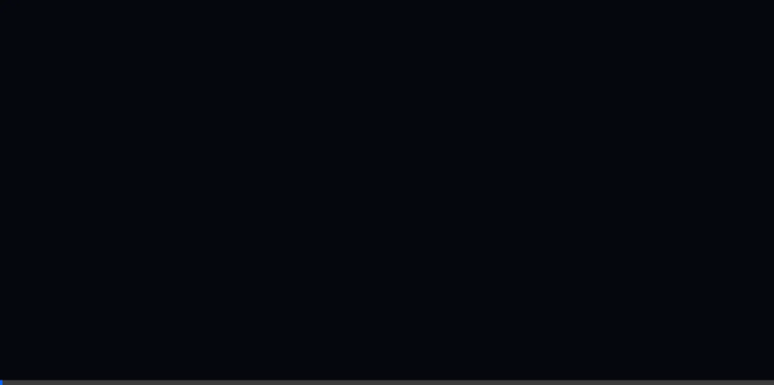
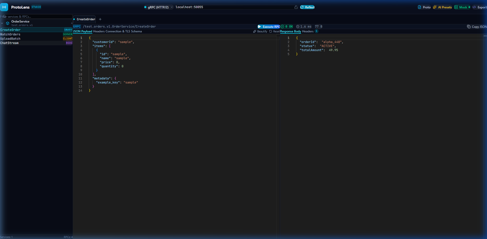

# ProtoLens

ProtoLens is a desktop studio, reflection explorer, and mock engine for gRPC, Connect-RPC, and Protobuf schemas.

It runs as a single Go binary with an embedded React and Monaco Editor frontend. It connects to any reflection-enabled gRPC server, extracts available services and methods without requiring local `.proto` files, executes unary and streaming RPC calls, and runs local schema-compliant mock servers.

```
┌────────────────────────────────────────────────────────────────────────┐
│                          ProtoLens Architecture                        │
└────────────────────────────────────────────────────────────────────────┘

[ Web UI / Local Desktop Workbench ] (http://localhost:50050)
              │
              ▼  (HTTP REST / WebSocket / Server-Sent Events)
[ ProtoLens Single Binary ] (Go Engine)
  ├── Static Asset Server: go:embed (Vite + React 19 + Monaco Editor)
  ├── Gateway & Session Manager
  │     ├── Multi-Environment Configuration (Local, Staging, Prod headers/TLS)
  │     └── In-Memory Workspace State
  ├── Protobuf & Schema Engine
  │     ├── gRPC Server Reflection Client (v1 & v1alpha)
  │     ├── Local Proto File Parser & AST Builder (protocompile)
  │     └── Dynamic Message Factory (JSON <-> Protobuf Binary translation)
  ├── RPC Invocation & Transport Layer
  │     ├── Standard gRPC Transport (HTTP/2 with TLS, mTLS, or plaintext)
  │     ├── Connect Protocol Client (Connect-RPC over HTTP/1.1 and HTTP/2)
  │     └── Bidirectional Streaming Multiplexer (WebSocket bridge)
  └── Mock Server Engine
        ├── In-Memory Dynamic gRPC Listener
        └── Faker / Schema-Compliant Response Generator
              │
              ▼ (HTTP/2 / TLS / plaintext)
[ Target gRPC / Connect / AI Inference Service ] (Triton, vLLM, Backend APIs)
```



## Why ProtoLens

In 2023, BloomRPC was archived, leaving backend engineers with few dedicated tools for gRPC testing. Existing alternatives often require heavy cloud accounts, lack streaming support, or operate solely through the command line.

ProtoLens provides a lightweight, local-first client:

* Zero configuration reflection: Connect to `localhost:50051` or remote endpoints. ProtoLens fetches descriptors over gRPC Server Reflection (v1 and v1alpha) and generates clean JSON payload templates automatically.
* Local proto loader: Drag and drop `.proto` files or point to a directory with automatic resolution of standard Google protobuf imports.
* Multi-protocol support: Invoke standard gRPC (HTTP/2), gRPC-Web, and Connect protocol services from the same interface.
* Streaming studio: Send and inspect messages in real time for client streaming, server streaming, and bidirectional full-duplex RPCs.
* Embedded mock server: Start a dynamic gRPC mock server on any local port directly from loaded schemas, with configurable latency and error simulation.
* CLI and code export: Export configured requests to `grpcurl`, `curl`, Go, or TypeScript snippets with one click.
* Small footprint: Single static binary in Go (<30MB RAM usage), no Electron runtime, zero external runtime dependencies.

## Feature comparison

| Feature | ProtoLens | BloomRPC (Archived) | Postman | grpcurl |
| :--- | :--- | :--- | :--- | :--- |
| Runtime Size | < 30 MB | ~150 MB (Electron) | > 250 MB | < 25 MB |
| Account / Cloud Required | No (Local-first) | No | Yes (mandatory login) | No |
| Server Reflection (v1 & v1alpha) | Yes | Yes (v1alpha only) | Partial | Yes |
| Connect-RPC Support | Yes | No | Partial | No |
| Full-Duplex Streaming Timeline | Yes | Basic | Basic | CLI only |
| Embedded Dynamic Mock Server | Yes | No | Cloud-only | No |
| AI Inference Presets (Triton/vLLM) | Yes | No | No | No |
| Single Binary Distribution | Yes | No | No | Yes |

## Studio interface



## Quick start

### Install via Go

```bash
go install github.com/alexandrmotologa/protolens@latest
```

### Run

```bash
# Launch the desktop workbench on default port 50050
protolens

# Launch and immediately reflect a target endpoint
protolens -t localhost:50051

# Launch loading local proto files
protolens --proto-dir ./proto -t api.internal:443 --tls

# Start a standalone mock server from proto definitions
protolens mock --proto ./service.proto --port 50055

# Headless reflection output to JSON
protolens reflect localhost:50051 --json
```

## Architecture

ProtoLens consists of two layers packaged into one executable:

1. Go Backend Engine:
   * Schema parser powered by `github.com/bufbuild/protocompile`, replacing deprecated reflection libraries.
   * Universal gRPC invoker using `dynamicpb.Message` and `google.golang.org/protobuf/encoding/protojson`.
   * Real-time WebSocket bridge mapping browser WebSocket frames to bidirectional gRPC client streams.
   * Dynamic mock server using `grpc.UnknownServiceHandler` to satisfy requests against loaded method descriptors without generating Go code.

2. Web Studio Frontend:
   * React 19, TypeScript, and Vite bundled into the Go binary via `go:embed`.
   * Monaco Editor for JSON payloads with auto-formatting and schema completions.
   * Real-time virtualized timeline for inspecting streaming messages and chunk latencies.

## Development

Requirements:
* Go 1.23 or newer
* Node.js 20 or newer
* npm 10 or newer

```bash
# Clone the repository
git clone https://github.com/alexandrmotologa/protolens.git
cd protolens

# Install UI dependencies
cd ui
npm install
npm run build
cd ..

# Run backend tests
go test -v ./...

# Run development server
go run main.go
```

## License

MIT License. See [LICENSE](LICENSE) for details.
